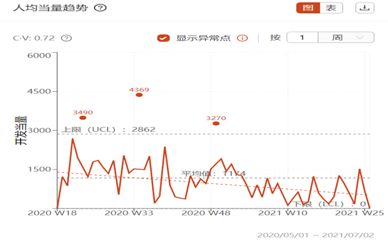
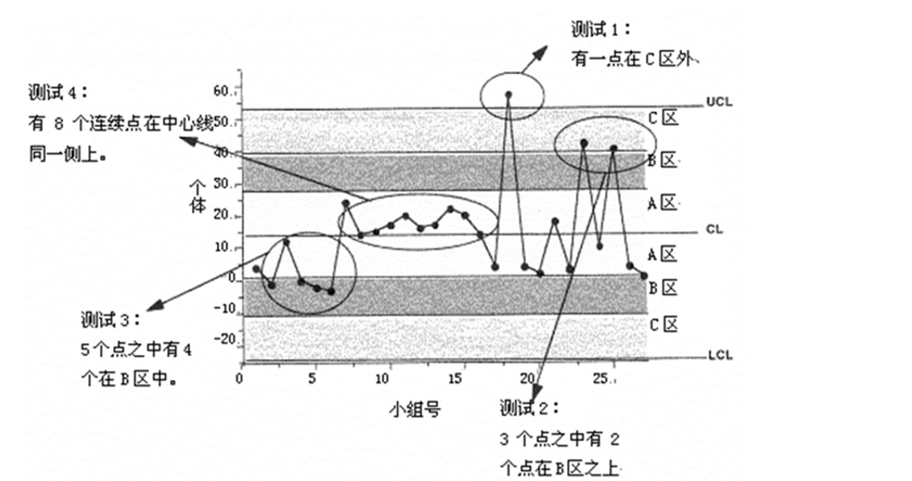
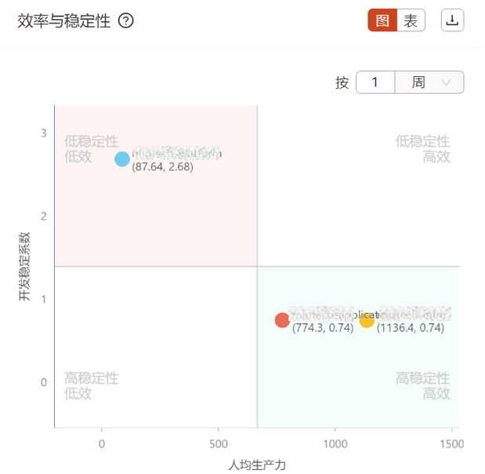

# 代码当量

| 属性   |                                                                                                                                                                                                     |
| ---- | --------------------------------------------------------------------------------------------------------------------------------------------------------------------------------------------------- |
| 指标定义 | 代码当量是对开发工作量的一种合理估计，通过开发过程对抽象语法树的更改量计算，也可理解为源代码编译成的抽象语法树的复杂度。                                                                                                                                        |
| 指标价值 | 
1. 与代码行数、提交数等指标等浅层统计相比，代码当量不易受到编程习惯或特定行为的干扰（如换行、注释等），并且更能反映代码开发所涉及的逻辑量或复杂度。 2. 作为代码贡献的基准指标，为研发效能提供更合理的度量，并用于对需求复杂度估算的准确性进行校准。 3. 采用千代码当量缺陷率替代千行代码缺陷率，可以有效避免人为干扰对代码规模的影响，客观统计基于规模的代码质量。
 |
| 指标来源 | 静态代码分析系统                                                                                                                                                                                            |
| 实践域  | 开发                                                                                                                                                                                                  |
| 认知域  | 交付速率                                                                                                                                                                                                |
| 度量范围 | 项目、团队                                                                                                                                                                                               |

## MARI 方法

### 度量（Measure）

* 从项目或团队维度，按需求周期及步长统计代码当量。


根据历史数据，注意剔除非正常生产力数据（如：框架代码、第三方合入代码等）造成的异常高值，避免对实际代码产能分析的干扰。


*   统计分析周期内相应步长（1周、双周、1月）的人均代码当量，得到人均生产率数据。

    人均生产率计算公式为：`人均代码当量 = 统计周期内相应步长总代码当量/代码提交者数。`

### 分析（Analyze）

* 累计当量趋势
  *   项目/团队累计代码当量趋势

      观察团队活跃度、代码增速合理性。对比分析同类项目，在人力接近的情况下，观察人力投入产出的差异及原因。

      *   版本周期累计当量趋势

          可通过观察即将发版的代码是否仍存在活跃的代码提交，来判断版本是否趋于稳定。

* 人均当量趋势
  *   单值控制图

      使用控制图对项目/团队的人均当量进行分析，当一组随机生产率数据样本符合正态分布，且数据过程较为稳定（离散系数小于0.5），可通过1.96\~2个标准差建立上下限进行样本数据的观察分析。

      落入上下限之外的数据概率为5%，这部分数据通常会作为小概率事件的异常值进行识别。

*   离散系数图

    离散系数是测量数据离散程度的相对统计量,主要是用于比较不同样本数据的离散程度。

    计算公式：`离散系数 = 标准差/均值`，离散系数越小代表数据的聚拢及稳定性越高。

    过程数据稳定的价值是可为数据波动提供合理的判断区间，同时基于稳定的生产率过程数据，可进行建模分析，对按期付率、工作量等变量提供预测分析。

    当离散系数大于0.5时，需分析数据过于分散的原因。

*   异常值检验

    对计划建立控制图的人均当量样本进行异常值检验，如数据出现异常离群点，需对数据进行合理剔除后再进行分析。

    当数据出现显著分层，需结合实际情况分析原因，并合理选取建立过程参考基线的范围。

    控制图分析判异原则：

    * 数据点出界即判断为异常
    * 界内点排列不随机即判断为异常
    * 连续链：连续9个数据点在中心线之下或之上
    * 间断链：大多数数据点在中心线一侧（链为控制图中各数据点之间的连线）
    * 多数据点屡屡靠近控制界限（在2-3倍的标准差区域内出现）
    * 倾向性（连续不少于6个数据点有上升或下降的倾向）与周期性
    * 连续14个数据点中相邻交替上下

*   分析控制图

    通过拟合线趋势，对统计周期内，相应步长（周/月）的生产率水平的上升/下降趋势变化进行判断。

通过生产率波动规律，可观察生产率是否存在连续上升、下降或数据分层等现象。连续上升、下降提示受产品排期、任务拆分及人力调配合理性的影响，引发的忙闲不均现象。

当数据出现向上或向下分层，通常与业务需求的紧凑性、人力资源的变化等因素相关，需进一步分析。

*   生产率横向分析

    横向分析，有助于了解组织整体水平，建立参考基线，并识别短板进行改进。

    通过箱线图或柱状图，进行项目/团队间人均当量的横向分析，基于中位数或均值对生产率偏低或偏高值的合理性进行分析。

同时，通过效率（人均生产率）与稳定性（离散系数）双变量散点图，分析各项目/团队在不同象限的分布，分析项目/团队在效率稳定性上的表现。

使用历史基线或行业指标，对过程性能进行对标分析，以了解现状与历史生产力、行业指标之间的比较情况。

### 回顾（Review）

基于分析结果，聚焦少数关键异常点，采用头脑风暴对影响因素进行罗列，并进一步识别关键影响因素。

以下为可参考的回顾思路：

### 改进（Improve）

基于回顾结果，聚焦关键根因，盘点潜在的改善措施。

改进步骤的思考与盘点，一方面能进一步验证影响因素与问题之间的关联性，另一方面也能辅助团队制定可落地的改善方案。

以下为可参考的改进思路：

| 影响因素  | 问题分析                                                                                                                 | 改进建议                                                                                                                                                                                                                                 |
| ----- | -------------------------------------------------------------------------------------------------------------------- | ------------------------------------------------------------------------------------------------------------------------------------------------------------------------------------------------------------------------------------ |
| 产品排期  | 产品排期不紧凑、缺乏规律性，导致项目/团队忙闲不匀，出现活等人、人等活的现象。                                                                              | 
1. 参照历史生产力（生产率水平），预估季度、月度需求的交付能力，按生产率进行产品需求的排期及项目规划。 2. 建立需求、生产力、开发人数三者间的数据关联，合理预估可用资源及需求的交付周期。 3. 团队线根据产品排期节奏，参照个人生产率预估工作量，提前规划人力资源。 4. 按迭代任务计划，合理规划阶段性清理技术债及重构任务。 5. 平衡资源负载及任务饱和度。避免任务过载造成的加班赶工，及任务饱和度低引发的资源冗余。
 |
| 需求稳定性 | 
1. 需求颗粒度大，拆分不细，导致需求模糊，理解不一致，开发阶段需求频繁变更。 2. 缺少必要的需求变更控制流程，需求变更随意，缺少接收入口及规则。
                                 | 
1. 需求拆分尽可能细（纳入迭代需求列表时，对超过8人时的需求/功能进一步拆分） 2. 细分需求后，按照需求价值，优先实现最有价值且相对稳定的功能点。使每个迭代均可交付演示版本。 3. 利用历史偏差率、 开发经验，提高迭代估算的准确率。4. 建立需求分级变更管控流程，提高需求稳定性，降低需求蔓延、变更造成的返工工作量。
                                                     |
| 资源调配  | 
1. 特定任务只能由少数人力承担。 2. 项目长时段闲置人力未得到及时释放。 3. 缺少客观衡量人力投入产出的指标数据。
                                            | 
1. 通过需求反讲、业务说明会、代码评审等方式，对复杂业务及逻辑进行说明及培训，实现人力备份。 2. 均衡迭代任务拆分和分配，减少任务间的串行等待时长。 3. 通过思码逸贡献者视图，分析个人累计代码增量、增速，判断人力投入产出合理性。
                                                                                                   |
| 人力复用  | 人力在多个并行任务间切换，降低了在单一任务的专注度，同时造成任务切换的浪费。                                                                               | 
1. 按项目线划分团队，减少团队成员跨项目、跨业务的人力复用。 2. 对于无法避免的人力复用，提高单一任务的专注时间，避免任务间频繁切换。个人跨项目数不超过5个。
                                                                                                                                          |
| 研发流程  | 阶段式开发无法快速响应需求的变更，重复工作和返工加大工期的同时，降低了生产效率。                                                                             | 
1. 对于新项目、新业务，需求不稳定的项目，采用短周期迭代模式，迭代周期不超过2周。 2. 各迭代需明确验收标准，每个迭代结束，需交付可演示版本进行需求确认，并作为进入下一迭代的入口准则。
                                                                                                                             |
| 评价标准  | 
1. 缺少统一的效能评价标准 。 2. 缺少评估贡献的牵引指标，形成面向需求价值和代码价值的开发氛围。（代码行不能准确体现个人/团队的贡献价值。） 3. 个体贡献的黑盒，难以形成自我管理、自我提升的驱动力。
 | 
1. 按业务差异（前端/后端）、项目阶段差异（开发阶段/维护阶段）分别建立人均生产率基线，用以分析项目/团队/个人的生产率水平及变化。 2. 有效利用开发价值排行榜作为牵引指标，客观评估贡献者价值。
                                                                                                                        |
| 代码质量  | 单元测试、代码走查这两类动态/静态测试手段，可有效降低代码缺陷率及返工工作量。                                                                              | 
1. 定义代码走查/评审的覆盖范围，落实编码规范，进一步提升代码质量，定义评价设计好坏的准则，提升设计质量。 2. 定义单元测试的覆盖范围。可参考的单元测试准则：  - 新平台产品类代码的前1K-2K代码 - 新项目第一个月的代码 - 新员工头3个月的代码 - 核心功能代码  - 圈复杂度高于15的代码   f.底层复用组件。
                                       |

制定改进措施时，须从见效周期、成本投入、可行性及重要性等维度进行评估，区分轻重缓急。改进措施可采用矩阵法进行优先级评分，通过循序渐进的改进策略进行落地推进。

针对回顾结果，对阻塞环节，从规范、流程、工具、行为等方面给出针对性改进措施，明确提升目标、改进措施、验证周期及责任人。

改进成果也应当是可量化的，便于持续度量，追踪改进效果。
