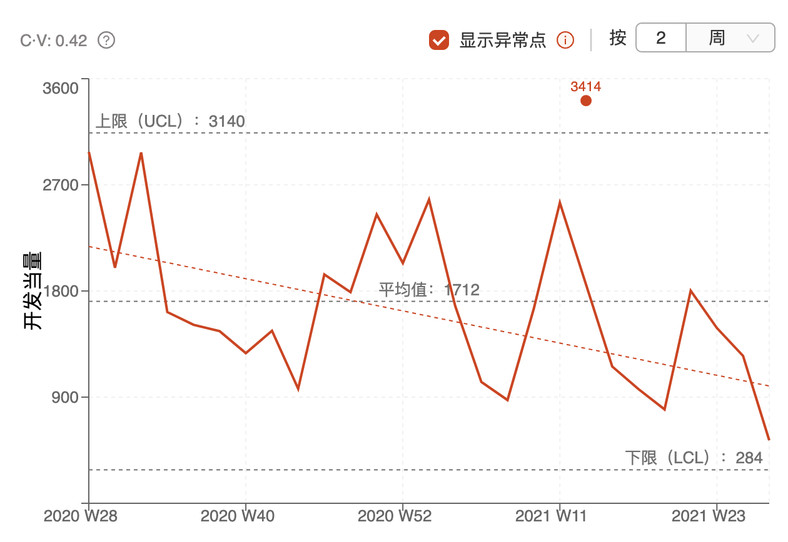
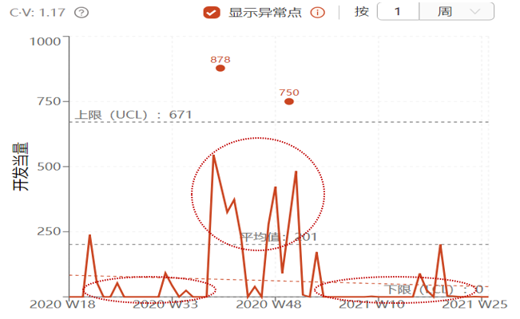
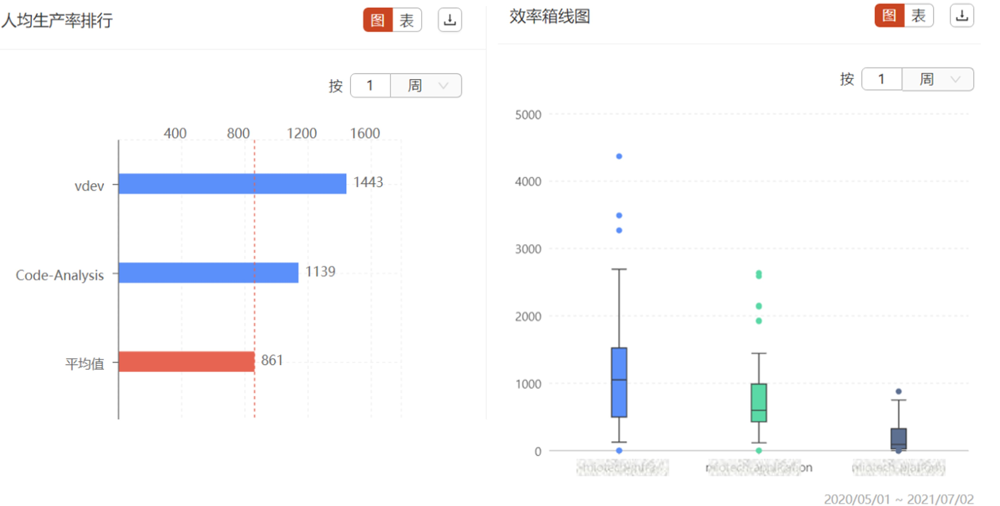
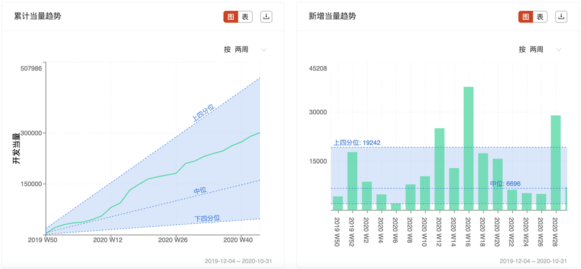
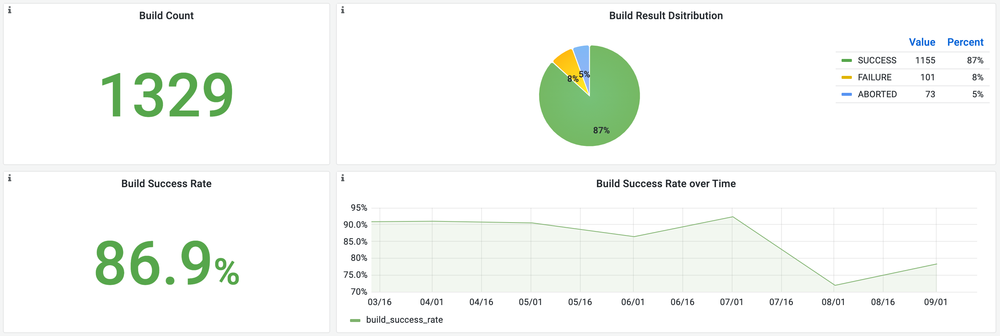

# 指标索引

## 按主认知域划分

### 交付价值

### 交付速率

### 交付质量

### 交付能力

### 交付成本

## 需求颗粒度

| 属性   |                                                                                                                                                                                                                                                  |
| ---- | ------------------------------------------------------------------------------------------------------------------------------------------------------------------------------------------------------------------------------------------------ |
| 指标定义 | 
需求颗粒度即一个需求的大小，反映该需求设计开发的复杂度。 在需求开发之前，需求颗粒度可以被预估，例如采用故事点、功能点等方法；在需求开发之后，需求颗粒度可以通过其实际的工作量进行回顾，例如采用对应代码的行数、<a href="">代码当量</a>等。 通常还可以对比前后预估和回顾的结果，分析差异，逐步校准团队对需求颗粒度的把握，有利于项目管理中事务的合理安排和顺畅流转，提高资源利用率。
 |
| 指标价值 | 需求分解的颗粒度足够细致，一方面能够提高团队的项目管理能力，帮助开发清晰理解需求，高质量交付；另一方面能够使团队快速获得业务反馈，敏捷响应变化，提升客户满意度。                                                                                                                                                                 |
| 指标来源 | 项目管理系统                                                                                                                                                                                                                                           |
| 实践域  | 需求、开发                                                                                                                                                                                                                                            |
| 认知域  | 交付质量                                                                                                                                                                                                                                             |
| 度量范围 | 项目                                                                                                                                                                                                                                               |

### 度量（Measure）

* 统计每个需求的故事点数（均值、中位数及80%分位）。

* 统计每个需求的交付时长（均值或中位数或80%分位），从研发到发布的时间（或者用户可配置）。
* 统计项目维度周期内的故事点数、代码行数或代码当量。计算平均每故事点的代码行数或[代码当量](https://www.openmari.dev/)。

* 统计每人每天的代码行数或代码当量。

### 分析（Analyze）

* 一个良好的需求的编写应该遵循INVEST原则，根据以下6点对需求进行分析。
  * Independent：独立性
  * Negotiable：可商讨
  * Valuable：有价值
  * Estimable：可评估
  * Small：短小
  * Testable：可测试
* 分析80%的需求的故事点数的分布区间，比如是否小于5个（建议结合团队实际情况，根据单迭代可交付需求的大小，设定阈值））
* 分析80%的需求的交付时长的分布区间，比如是否小于5天（建议结合团队实际情况，根据迭代时长，设定阈值）
* 对比每故事点的代码行数或[代码当量](https://www.openmari.dev/)
* 对比每人每天的代码行数或[代码当量](https://www.openmari.dev/)的大小

### 回顾（Review）

针对以上对需求的INVEST原则的分析，调研是否满足以下6个方面：

* 独立的：这个功能是否是独立实现的，低耦合；
* 可商讨：这个功能是否是有细节的，可以讨论更具体的内容；
* 有价值：这个功能是否可以交付使用或验证，不是幻想的功能；
* 可估计：每个需求是否可以估算工作量，是否估算了故事点；
* 合适的小：每个需求是否可以在一个迭代或一周内完成；每个故事点是否可以让一两个开发花费一两天可以做完，即每故事点的代码行数或代码当量是否接近每人每天的代码行数或代码当量。
* 可测试：这个功能是否可以测试，不依赖其他的功能。

### 改进（Improve）

基于回顾结果，聚焦关键根因，从规范、流程、工具、行为等方面给出针对性改进措施，明确提升目标、改进措施、验证周期及责任人。

以下为可参考的改进思路：

* 增加需求的独立性，降低耦合。
* 增加需求的细节。
* 合理拆分需求，分解出的需求尽量在一个迭代或一周内完成交付，如果无法完成就尝试继续分解。因为只有交付的需求才是有价值的，无法交付的需求对于当前迭代来说就是浪费。
* 为需求估算故事点。
* 尽量保证每故事点的代码行数或代码当量接近每人每天的代码行数或代码当量，让一两个开发花费一两天可以做完。
* 保证需求功能的独立和完成性，使其可测试。

改进成果也应当是可量化的，便于持续度量，追踪改进效果。

## 代码当量

| 属性   |                                                                                                                                                                                                     |
| ---- | --------------------------------------------------------------------------------------------------------------------------------------------------------------------------------------------------- |
| 指标定义 | 代码当量是对开发工作量的一种合理估计，通过开发过程对抽象语法树的更改量计算，也可理解为源代码编译成的抽象语法树的复杂度。                                                                                                                                        |
| 指标价值 | 
1. 与代码行数、提交数等指标等浅层统计相比，代码当量不易受到编程习惯或特定行为的干扰（如换行、注释等），并且更能反映代码开发所涉及的逻辑量或复杂度。 2. 作为代码贡献的基准指标，为研发效能提供更合理的度量，并用于对需求复杂度估算的准确性进行校准。 3. 采用千代码当量缺陷率替代千行代码缺陷率，可以有效避免人为干扰对代码规模的影响，客观统计基于规模的代码质量。
 |
| 指标来源 | 静态代码分析系统                                                                                                                                                                                            |
| 实践域  | 开发                                                                                                                                                                                                  |
| 认知域  | 交付速率                                                                                                                                                                                                |
| 度量范围 | 项目、团队                                                                                                                                                                                               |

### 度量（Measure）

* 从项目或团队维度，按需求周期及步长统计代码当量。


根据历史数据，注意剔除非正常生产力数据（如：框架代码、第三方合入代码等）造成的异常高值，避免对实际代码产能分析的干扰。


*   统计分析周期内相应步长（1周、双周、1月）的人均代码当量，得到人均生产率数据。

    人均生产率计算公式为：`人均代码当量 = 统计周期内相应步长总代码当量/代码提交者数。`

### 分析（Analyze）

* 累计当量趋势
  *   项目/团队累计代码当量趋势

      观察团队活跃度、代码增速合理性。对比分析同类项目，在人力接近的情况下，观察人力投入产出的差异及原因。

      *   版本周期累计当量趋势

          可通过观察即将发版的代码是否仍存在活跃的代码提交，来判断版本是否趋于稳定。

* 人均当量趋势
  *   单值控制图

      使用控制图对项目/团队的人均当量进行分析，当一组随机生产率数据样本符合正态分布，且数据过程较为稳定（离散系数小于0.5），可通过1.96\~2个标准差建立上下限进行样本数据的观察分析。

      落入上下限之外的数据概率为5%，这部分数据通常会作为小概率事件的异常值进行识别。

*   离散系数图

    离散系数是测量数据离散程度的相对统计量,主要是用于比较不同样本数据的离散程度。

    计算公式：`离散系数 = 标准差/均值`，离散系数越小代表数据的聚拢及稳定性越高。

    过程数据稳定的价值是可为数据波动提供合理的判断区间，同时基于稳定的生产率过程数据，可进行建模分析，对按期付率、工作量等变量提供预测分析。

    当离散系数大于0.5时，需分析数据过于分散的原因。

*   异常值检验

    对计划建立控制图的人均当量样本进行异常值检验，如数据出现异常离群点，需对数据进行合理剔除后再进行分析。

    当数据出现显著分层，需结合实际情况分析原因，并合理选取建立过程参考基线的范围。

    控制图分析判异原则：

    * 数据点出界即判断为异常
    * 界内点排列不随机即判断为异常
    * 连续链：连续9个数据点在中心线之下或之上
    * 间断链：大多数数据点在中心线一侧（链为控制图中各数据点之间的连线）
    * 多数据点屡屡靠近控制界限（在2-3倍的标准差区域内出现）
    * 倾向性（连续不少于6个数据点有上升或下降的倾向）与周期性
    * 连续14个数据点中相邻交替上下

*   分析控制图

    通过拟合线趋势，对统计周期内，相应步长（周/月）的生产率水平的上升/下降趋势变化进行判断。

通过生产率波动规律，可观察生产率是否存在连续上升、下降或数据分层等现象。连续上升、下降提示受产品排期、任务拆分及人力调配合理性的影响，引发的忙闲不均现象。

当数据出现向上或向下分层，通常与业务需求的紧凑性、人力资源的变化等因素相关，需进一步分析。

*   生产率横向分析

    横向分析，有助于了解组织整体水平，建立参考基线，并识别短板进行改进。

    通过箱线图或柱状图，进行项目/团队间人均当量的横向分析，基于中位数或均值对生产率偏低或偏高值的合理性进行分析。

同时，通过效率（人均生产率）与稳定性（离散系数）双变量散点图，分析各项目/团队在不同象限的分布，分析项目/团队在效率稳定性上的表现。

使用历史基线或行业指标，对过程性能进行对标分析，以了解现状与历史生产力、行业指标之间的比较情况。

### 回顾（Review）

基于分析结果，聚焦少数关键异常点，采用头脑风暴对影响因素进行罗列，并进一步识别关键影响因素。

以下为可参考的回顾思路：

### 改进（Improve）

基于回顾结果，聚焦关键根因，盘点潜在的改善措施。

改进步骤的思考与盘点，一方面能进一步验证影响因素与问题之间的关联性，另一方面也能辅助团队制定可落地的改善方案。

以下为可参考的改进思路：

| 影响因素  | 问题分析                                                                                                                 | 改进建议                                                                                                                                                                                                                                 |
| ----- | -------------------------------------------------------------------------------------------------------------------- | ------------------------------------------------------------------------------------------------------------------------------------------------------------------------------------------------------------------------------------ |
| 产品排期  | 产品排期不紧凑、缺乏规律性，导致项目/团队忙闲不匀，出现活等人、人等活的现象。                                                                              | 
1. 参照历史生产力（生产率水平），预估季度、月度需求的交付能力，按生产率进行产品需求的排期及项目规划。 2. 建立需求、生产力、开发人数三者间的数据关联，合理预估可用资源及需求的交付周期。 3. 团队线根据产品排期节奏，参照个人生产率预估工作量，提前规划人力资源。 4. 按迭代任务计划，合理规划阶段性清理技术债及重构任务。 5. 平衡资源负载及任务饱和度。避免任务过载造成的加班赶工，及任务饱和度低引发的资源冗余。
 |
| 需求稳定性 | 
1. 需求颗粒度大，拆分不细，导致需求模糊，理解不一致，开发阶段需求频繁变更。 2. 缺少必要的需求变更控制流程，需求变更随意，缺少接收入口及规则。
                                 | 
1. 需求拆分尽可能细（纳入迭代需求列表时，对超过8人时的需求/功能进一步拆分） 2. 细分需求后，按照需求价值，优先实现最有价值且相对稳定的功能点。使每个迭代均可交付演示版本。 3. 利用历史偏差率、 开发经验，提高迭代估算的准确率。4. 建立需求分级变更管控流程，提高需求稳定性，降低需求蔓延、变更造成的返工工作量。
                                                     |
| 资源调配  | 
1. 特定任务只能由少数人力承担。 2. 项目长时段闲置人力未得到及时释放。 3. 缺少客观衡量人力投入产出的指标数据。
                                            | 
1. 通过需求反讲、业务说明会、代码评审等方式，对复杂业务及逻辑进行说明及培训，实现人力备份。 2. 均衡迭代任务拆分和分配，减少任务间的串行等待时长。 3. 通过思码逸贡献者视图，分析个人累计代码增量、增速，判断人力投入产出合理性。
                                                                                                   |
| 人力复用  | 人力在多个并行任务间切换，降低了在单一任务的专注度，同时造成任务切换的浪费。                                                                               | 
1. 按项目线划分团队，减少团队成员跨项目、跨业务的人力复用。 2. 对于无法避免的人力复用，提高单一任务的专注时间，避免任务间频繁切换。个人跨项目数不超过5个。
                                                                                                                                          |
| 研发流程  | 阶段式开发无法快速响应需求的变更，重复工作和返工加大工期的同时，降低了生产效率。                                                                             | 
1. 对于新项目、新业务，需求不稳定的项目，采用短周期迭代模式，迭代周期不超过2周。 2. 各迭代需明确验收标准，每个迭代结束，需交付可演示版本进行需求确认，并作为进入下一迭代的入口准则。
                                                                                                                             |
| 评价标准  | 
1. 缺少统一的效能评价标准 。 2. 缺少评估贡献的牵引指标，形成面向需求价值和代码价值的开发氛围。（代码行不能准确体现个人/团队的贡献价值。） 3. 个体贡献的黑盒，难以形成自我管理、自我提升的驱动力。
 | 
1. 按业务差异（前端/后端）、项目阶段差异（开发阶段/维护阶段）分别建立人均生产率基线，用以分析项目/团队/个人的生产率水平及变化。 2. 有效利用开发价值排行榜作为牵引指标，客观评估贡献者价值。
                                                                                                                        |
| 代码质量  | 单元测试、代码走查这两类动态/静态测试手段，可有效降低代码缺陷率及返工工作量。                                                                              | 
1. 定义代码走查/评审的覆盖范围，落实编码规范，进一步提升代码质量，定义评价设计好坏的准则，提升设计质量。 2. 定义单元测试的覆盖范围。可参考的单元测试准则：  - 新平台产品类代码的前1K-2K代码 - 新项目第一个月的代码 - 新员工头3个月的代码 - 核心功能代码  - 圈复杂度高于15的代码   f.底层复用组件。
                                       |

制定改进措施时，须从见效周期、成本投入、可行性及重要性等维度进行评估，区分轻重缓急。改进措施可采用矩阵法进行优先级评分，通过循序渐进的改进策略进行落地推进。

针对回顾结果，对阻塞环节，从规范、流程、工具、行为等方面给出针对性改进措施，明确提升目标、改进措施、验证周期及责任人。

改进成果也应当是可量化的，便于持续度量，追踪改进效果。

## 代码评审轮数

| 属性   |                                                                                                                       |
| ---- | --------------------------------------------------------------------------------------------------------------------- |
| 指标定义 | 
开发者请求代码合并后，评审者与开发者之间进行评审交流的轮数。 评审者每做出一次同意合并或建议修改的判断，为一轮评审。若开发者修改代码后再次提交合并请求，则评审轮数加一，直至代码被合并或拒绝。
             |
| 指标价值 | 
1. 代码评审轮数体现开发者提交代码的质量，评审轮数越少，代表一次性通过率越高，即代码质量越高。 2. 代码评审需要通过人工审核的方式发现代码中的潜在缺陷，属人力密集型工作，合理地减少代码评审轮数，可降低人力成本。
 |
| 指标来源 | 版本控制系统                                                                                                                |
| 实践域  | 开发                                                                                                                    |
| 认知域  | 交付质量                                                                                                                  |
| 度量范围 | 项目、团队                                                                                                                 |

### 度量（Measure）

* 分别统计开发者和评审者的代码评审轮数。
* 从项目或团队维度，对所属成员的代码评审轮数进行聚合统计。

### 分析（Analyze）

*   开发者平均代码评审轮数

    选定时间段，并结合任务复杂度，统计开发者的平均代码评审轮数。这个指标可以一定程度反映出该开发者的代码质量，也为定位项目瓶颈提供了参考信息。

    在选定时间段内，某位开发者的`平均代码评审轮数 = 该时间段内该开发者提交的所有合并请求所经历的评审轮数总和 / 代码合并请求数`。

    关注连续排名靠前或高于基线水平的开发者，分析是否存在聚类现象。
*   评审者平均代码评审轮数

    选定时间段，并结合任务复杂度，统计评审者的平均代码评审轮数。这个指标可以一定程度反映出评审者的评审风格，也为定位项目瓶颈提供了参考信息。

    在选定时间段内，某位评审者的`平均代码评审轮数 = 该时间段内该评审者的评审轮数总和 / 该评审者处理的代码合并请求数`。

    关注排序连续靠前及靠后的评审者，分析是否存在聚类现象。
*   评审者代码评审总轮数

    选定时间段，并结合任务复杂度，统计评审者的总评审轮数。这个指标可以一定程度反映出评审者在评审环节的活跃度和工作负载，也为定位项目瓶颈提供了参考信息。

    关注连续排名靠前或高于基线水平的评审者，以及排序连续靠后的评审者，分析团队成员评审工作负载是否健康。
*   项目/团队维度统计

    从项目或团队维度，结合项目所属阶段与团队任务复杂度，对所属成员的代码评审轮数进行聚合统计，获得平均代码评审轮数，代码评审总轮数等数据，可以一定程度反映出项目与团队评审工作人员分配是否合理，当前负载是否健康。

### 回顾（Review）

针对代码评审轮数指标异常偏高或偏低的情况，结合团队及项目实际情况，调研原因。

以下以代码评审轮数过高为例，列举几条可能的原因：

* 开发者方面
  * 编码不符合规范，代码可读性较低
  * 合并请求颗粒度过大，不易理解
  * 代码质量问题较多，包括缺陷及软件工程质量问题（如结构设计不合理）
  * 未能清晰理解业务需求
* 评审者方面
  * 因主观因素评审尺度较严格
  * 评审尺度未符合编码规范
* 项目性质方面
  * 项目处于早期阶段，或者任务难度较高

调查多个案例后，可继续统计分析异常原因的分布情况，观察是否某一类原因偏多，更进一步调研。

以下以开发者代码质量问题较多为例，列举几条可参考的调查思路：

* 团队是否使用开发自测工具？是否设置了关键自查项？是否建立了自测缺陷处理规范？
* 代码提交人工评审前，开发者是否使用工具进行自测？是否按照规范进行了严重缺陷的修复?
* 编码规范培训、实施、考核是否到位？
* 开发者是否需要业务、技术、规范方面的进一步培训？
* 代码评审的反馈中，有无高频出现的质量优化建议？可否沉淀为规范,或用于优化自动检测工具？

### 改进（Improve）

针对回顾结果，对阻塞环节，从规范、流程、工具、行为等方面给出针对性改进措施，明确提升目标、改进措施、验证周期及责任人。

以下为可参考的改进思路:

* 定期基于代码评审的典型问题，更新《编码规范》及代码评审检查单，保证规范及检查单的可用性。
* 根据代码评审的典型问题，优化静态检测工具的检测规则，减少编码规范类问题遗漏到人工评审。
* 当代码评审轮数持续偏高时，需根据调研结果从编码规范、代码评审检查单、面向作者进行培训及考核。
* 明确代码提交人工评审的入口规则（如：先解决静态扫描出的重点问题再人工评审，建立核心10-20条代码评审自查/检查项。）
* 建立评审专家抽查制度，保证代码评审的质量，避免代码评审不充分造成的缺陷向下游测试泄露。
* 根据功能实现的复杂度、业务类型等，为代码评审选择合适的代码评审者。

改进成果也应当是可量化的，便于持续度量，追踪改进效果。

## 构建次数

| 属性   |                                                             |
| ---- | ----------------------------------------------------------- |
| 指标定义 | 单位时间内软件进行编译构建的次数。持续构建有助于及早发现缺陷和修复缺陷。                        |
| 指标价值 | 从项目的维度展示各个周期的构建次数、构建成功次数以及构建成功率。快速定位构建出现的问题，同时直观的了解项目的构建情况。 |
| 指标来源 | CI/CD系统                                                     |
| 实践域  | 开发、测试、发布                                                    |
| 认知域  | 交付能力                                                        |
| 度量范围 | 项目                                                          |

### 度量（Measure）

* 统计项目维度构建总次数、构建成功次数、构建失败次数。
* 统计周期内构建总次数、构建成功次数、构建失败次数。

* 分别统计开发、测试、发布阶段构建总次数、构建成功次数、构建失败次数。

### 分析（Analyze）

* 按项目维度，横向分析、对比不同项目的构建次数，对最大值、最小值或者低于平均值的项目进行下钻分析。
* 按阶段下钻分析开发、测试、发布阶段的构建次数，分析各阶段构建次数的合理性，找到瓶颈点。
* 分析各个周期内构建次数的变化趋势，进行纵向对比，对最大值、最小值、连续上升、连续下降的周期进行调研。

### 回顾（Review）

针对构建次数出现异常的项目和迭代周期，进行根本原因的分析、调研和回顾。

以构建次数偏少/降低为例，进行如下根因分析：

* 上游的需求、开发任务是否饱满、均匀？
* 开发人员是否每日小步多次提交？
* 构建过程是否自动化？
* 构建自动化的调度机制是否高效？

### 改进（Improve）

基于回顾结果，聚焦关键根因，从规范、流程、工具、行为等方面给出针对性改进措施，明确提升目标、改进措施、验证周期及责任人。

以构建次数偏少/降低为例，以下为可参考的改进思路：

* 合理进行需求排期和任务分配，避免人等活的情况。
* 需求/任务颗粒度尽量小，提倡每日小步多次提交。
* 自动化构建过程，要求构建自动化率达到100%。
* 调整自动化构建的调度机制，提高构建吞吐量。

改进成果也应当是可量化的，便于持续度量，追踪改进效果。

## 测试缺陷数

| 属性   |                                                                                                          |
| ---- | -------------------------------------------------------------------------------------------------------- |
| 指标定义 | 软件产品或程序正式发布上线前，在内部测试阶段发现的缺陷数。                                                                            |
| 指标价值 | 
1. 通过测试发现的缺陷数可为判断测试是否充分提供参考。 2. 通过测试缺陷数的收敛趋势，可以判断即将交付版本的稳定性。 3. 通过测试缺陷数，可为交付后逃逸缺陷的数量预测提供参考。
 |
| 指标来源 | 项目管理系统                                                                                                   |
| 实践域  | 测试                                                                                                       |
| 认知域  | 交付质量                                                                                                     |
| 度量范围 | 项目、团队                                                                                                    |

### 度量（Measure）

测试缺陷数是交付前，内部测试阶段发现的缺陷总数。

测试权限数可以从项目或团队维度统计，统计维度包括：缺陷总数、缺陷严重等级、缺陷分类、缺陷修复周期、缺陷所属责任人、缺陷累计趋势。

### 分析（Analyze）

*   缺陷异常点

    根据测试计划、定期或按需分析测试缺陷数，观察新增缺陷数，分析与历史相比，各版本缺陷新增是否处于合理区间（参照历史基线）。过高或过低需分析原因。

    一般情况下，指标过高表明版本质量偏低，潜在缺陷高于历史；指标过低则需结合测试用例，分析测试是否充分。

    连续观察多个数据点的新增缺陷数，分析数据变化是否存在异常或规律性。
*   缺陷严重等级

    不同等级缺陷可使用加权方式给出得分，可参考使用DI值（Defect Index，DI值是衡量软件质量的高低的指标之一。

    计算公式：`DI = 致命级别的问题个数*10+严重级别的问题个数*3+一般级别的问题个数*1+提示级别的问题个数*0.1）`

    DI值可用于评估软件质量。根据业务特征、逻辑复杂度、技术新颖度等，不同项目或团队可以设置不同的DI值评分标准。
*   缺陷分类

    可根据缺陷分布及严重等级，采用柱状图或帕累托，分析缺陷占比较高的功能模块、业务类别或相关分类，为测试策略的调整提供参考。
*   缺陷修复周期

    统计分析缺陷从提交到修复各状态时长，识别阻塞状态，分析合理缩短缺陷修复周期的措施，进而缩短MTTR（Mean Time To Recovery）。
*   缺陷累计增长趋势

    缺陷累计增长趋势，可用于判断缺陷的增速是否放缓，缺陷累计呈现平缓收敛趋势，是判断软件版本质量稳定的重要参考，也为产品是否符合交付条件提供判断依据。

    通常连续3-6个点呈现缺陷0增长可作为软件版本质量判稳的参考原则。而对缺陷仍活跃且未呈现收敛趋势的情况，需进行根因回顾分析。
*   缺陷责任归属

    缺陷责任归属分析，可为制定设计及代码评审策略提供参考，加强开发阶段质量内建。

    相比缺陷数绝对值，缺陷密度（`缺陷密度 = 所属owner缺陷数/对应owner代码贡献规模`）将代码贡献规模纳入考量，分析更加合理。

    通过强化设计及代码评审，实现缺陷检出前移，降低总体质量成本。

### 回顾（Review）

根据量化分析结果，进行异常数据的调研，分析根本原因：

* 测试缺陷数相比历史基线，偏低或偏高的根本原因是什么？是版本质量问题还是测试不充分？数据合理性是否解释得通？
* 如测试缺陷数合理，缺陷DI值评分是否偏高？
* 缺陷是否在某个分类（比如某类项目、某类模块或某些成员）中存在群集现象？原因可能是什么？
* 观察多个版本或连续周期内缺陷的增长趋势，对缺陷未收敛的原因进行分析。
* 分析缺陷责任归属分布，对缺陷密度偏高的原因进行分析，对典型缺陷进行复盘，并落实改进措施。

### 改进（Improve）

针对回顾结果，对阻塞环节，从规范、流程、工具、行为等方面给出针对性改进措施，明确提升目标、改进措施、验证周期及责任人。

以下为可参考的改进思路：

* 建立基线，以评估测试缺陷数、新增缺陷数、缺陷严重级别评分、缺陷收敛趋势的合理性。
* 基于测试缺陷分析结果，评估版本质量，适当调整测试策略及措施。

改进成果也应当是可量化的，便于持续度量，追踪改进效果。

## 测试缺陷率

| 属性   |                                                                                                  |
| ---- | ------------------------------------------------------------------------------------------------ |
| 指标定义 | 
软件产品或程序正式发布上线前，在内部测试阶段发现的缺陷数与对应代码量或代码变更量的比值，用以表征测试缺陷的密度。 如：测试千行代码缺陷率、千代码当量缺陷率
          |
| 指标价值 | 
测试缺陷率是衡量软件质量的主要指标。 使用测试缺陷缺陷率，通过软件可靠性模型，可对交付后逃逸的缺陷进行预测，以评估测试质量及软件交付质量，通过比较历史数据，评估测试的充分性
 |
| 指标来源 | 项目管理系统、版本控制系统                                                                                    |
| 实践域  | 测试                                                                                               |
| 认知域  | 交付质量                                                                                             |
| 度量范围 | 项目、团队                                                                                            |

### 度量（Measure）

测试缺陷率是很有价值的指标，能够用于度量代码质量、分析测试充分性、预测交付软件质量。但在实际使用中，应尽量避免将其作为考核指标，尤其是常见的千行代码缺陷率指标。 其潜在的负向牵引作用，容易引导团队成员做出一些对无益于长远、整体效能的行为，例如：

* 增大基数，增加无意义代码
* 把定长循环分开写，写成顺序方法
* 把可配置信息写死到代码中
* 大量的复制、粘贴代码
*   重新发明各种轮子

    因此，建议将千行代码缺陷率与代码复用度、合并请求通过率、圈复杂度等指标交叉分析，并使用千代码当量缺陷率\*替代千行代码缺陷率，提高指标粉饰的成本，对冲单指标的负向牵引作用。


[代码当量](https://www.openmari.dev/)是基于深度代码分析的代码工作量指标，可有效避免换行、空行、死代码等噪音对代码规模的影响。推荐采用千代码当量缺陷率，更合理地度量代码质量。


### 分析（Analyze）

*   环比分析

    分析与历史数据相比，各版本、迭代、功能模块的千行代码缺陷率是否处于合理区间（参照历史基线），过高或过低需分析原因。

    通常测试缺陷率过高（超过合理区间），表明版本质量偏低，测试发现与潜在缺陷率均高于历史。反之，则需结合测试用例分析测试是否充分。连续观察多个数据点的缺陷率变化，分析数据变化是否存在异常或规律性。
*   趋势分析

    与横向对比指标绝对值相比，该指标的**变化趋势更具比较意义**。因为不同模块业务不同，复杂度也不同，趋势变化更能体现缺陷率平缓收敛情况及软件质量的稳定性。

    观察多个版本或连续周期内缺陷率的变化趋势，对连续3-6个点上扬的数据进行提示分析。
*   下钻分析

    对千行代码缺陷率异常偏高或偏低的项目/团队进行下钻，分析缺陷率相关模块和责任人，识别异常点分别是否存在聚集。
*   CMMI（Capability Maturity Model Integration 能力成熟度模型集成）

    | CMMI等级 | 千行代码缺陷率参考值 |
    | ------ | ---------- |
    | CMM1级  | 11.95‰     |
    | CMM2级  | 5.52‰      |
    | CMM3级  | 2.39‰      |
    | CMM4级  | 0.92‰      |
    | CMM5级  | 0.32‰      |

    对于千行代码缺陷率过高、过低的情况，应辩证分析。缺陷率低不一定代表软件质量好，需结合测试覆盖度、缺陷严重级别等，分析测试方案合理性，同时，缺陷率过高也需要结合缺陷定义、定级进行合理性分析。
* 对二次或多次打开的缺陷进行统计，并进行根因分析。

### 回顾（Review）

根据分析结果，进行异常值的调研，分析根本原因：

* 参照测试缺陷率环比，及历史数据（基线）偏低或偏高的根本原因是什么。是版本质量问题还是测试不充分？数据的合理性是否解释得通？
* 缺陷率的连续上扬的原因是什么？
* 缺陷率是否集中于某些模块？原因是什么？
* 缺陷率是否集中于某些成员？原因是什么？
* 缺陷reopen的原因是什么，对于超过2次以上打开的缺陷进行根本原因的分析。
* 对于严重级别高，影响范围广的缺陷，须针对缺陷进行水平展开排查、修复。同时，对影响重大的缺陷进行复盘。
* 重大缺陷的复盘需要对根本原因进挖掘，识别避免或解决该缺陷的关键措施，复盘可基于时间顺序或事件脉络进行，要点应包括：缺陷现象/描述、时间线、根因分析、关键措施及后续行动。

### 改进（Improve）

针对调研结果，给出对应改进方案。一方面，调整测试策略、测试方案。另一方面，强化开发侧质量内建，通过加强需求、设计、代码评审等环节，提高软件质量。

以下为可参考的改进思路：

* 测试前移、测试人员尽早参与需求/设计评审。
* 开发自测、代码评审。
* 及时解决技术债：提高代码复用度、降低圈复杂度、及时解决代码问题、增加单元测试、增加注释、优化模块性。

改进成果也应当是可量化的，便于持续度量，追踪改进效果。

## 线上缺陷数

| 属性   |                                                                                      |
| ---- | ------------------------------------------------------------------------------------ |
| 指标定义 | 软件发布后，线上发生的缺陷数。线上缺陷是软件或程序中存在的某种破坏正常运行能力的问题、错误，或者隐藏的功能缺陷。缺陷的存在会导致软件产品在某种程度上不能满足用户的需要。 |
| 指标价值 | 线上缺陷数作为上线发布后的交付质量指标，代表了从研发阶段逃逸到交付后的缺陷，上线缺陷的数量、严重程度等级是用以衡量软件产品质量、测试质量的指标之一。           |
| 指标来源 | 项目管理系统                                                                               |
| 实践域  | 运营                                                                                   |
| 认知域  | 交付质量                                                                                 |
| 度量范围 | 项目                                                                                   |

### 度量（Measure）

* 按项目统计上线后缺陷数量、缺陷累计新增数量。
* 进一步统计：缺陷的严重等级、缺陷类型（业务、功能分类）或所属模块、缺陷来源。

### 分析（Analyze）

* 通过折线图，动态观察发布后缺陷数及累加趋势，分析缺陷的增幅、峰值及趋势是否趋向收敛，判断发布后版本的稳定性。
* 采用饼图，按缺陷的严重等级、缺陷类型进行分布分析，为评估缺陷的严重性及发版质量提供参考，可以历史数据为参照，进行对比分析，并对与历史水平的差异进行调查。
* 分析缺陷的来源包括，但不限于：用户反馈、监控系统（log信息）、第三方平台（电子商务）等，判断缺陷的主要来源渠道与缺陷数量及类型的关系。

### 回顾（Review）

造成缺陷逃逸的直接原因主要有两种：一种是测试人员设计测试用例不全面导致的遗漏，一种是有测试用例的覆盖，但是测试执行过程存在疏漏，导致一些显而易见的软件缺陷或本来应该发现的软件缺陷没有被测试出来。

以上是从测试环节本身分析得出的原因。从更全面的角度等来看，测试用例设计不全面或测试执行有遗漏的有多种潜在的根本原因：

* 需求不明确，导致测试人员对需求理解不到位，测试设计不够全面。
* 需求变更频繁，如在测试过程中发生需求变更，则容易导致测试人员获取到的需求不够及时、准确，测试案例不足以覆盖变更后的需求。
* 测试计划安排不够合理，测试时间过于紧张，导致测试人员没有充足的时间设计用例和执行测试。
* 测试设计人员对系统需求不够熟悉，或设计能力有限，案例覆盖度不够高。
* 测试执行人员与设计人员不同，不能全面理解测试用例的测试要点。
* 测试环境或版本与生产环境有差异，某些缺陷难以在测试环境被发现。
* 某些特殊数据才会出现的缺陷，因测试数据不足而难以发现。
* 设计人员和执行人员重视程度不足等主观因素

### 改进（Improve）

针对缺陷逃逸可能的客观原因，制定针对性措施，明确提升目标、改进措施、验证周期及责任人。

以下为可参考的改进思路：

* 测试尽早介入，在需求阶段就参与进来，加强需求的分析、确认和评审等工作，使测试人员可以充分理解需求以便设计准确而全面的测试用例。
* 控制需求变更的频次和时间，尤其是进入测试阶段后，尽量减少或避免需求变更，并在必要变更出现时加强信息的传达。
* 合理安排测试计划，和开发计划，避免开发时间延后从而挤占测试时间，为测试保留相对合理的设计和执行时间。
* 安排熟悉系统需求并掌握测试用例设计方法的人员设计测试用例，并加强对测试用例的评审。
* 如测试执行人员与设计人员不同，可安排案例评审和讲解会，确保测试执行人员全面掌握测试要点。
* 加强环境和版本管理，使测试环境尽量与生产环境一致。

改进成果也应当是可量化的，便于持续度量，追踪改进效果。

## 线上缺陷率

| 属性   |                                                                                         |
| ---- | --------------------------------------------------------------------------------------- |
| 指标定义 | 软件发布后，线上发现的缺陷数与对应代码量或代码变更量的比值，用以表征线上缺陷的密度。如：线上千行代码缺陷率、千代码当量缺陷率。                         |
| 指标价值 | 线上缺陷率作为上线发布后的质量指标，代表了从研发阶段逃逸到交付后的缺陷密度，是用以评估软件产品质量、测试质量的指标之一。在软件开发生命周期的后期，修复检测到的缺陷的成本较高。 |
| 指标来源 | 项目管理系统、版本控制系统                                                                           |
| 实践域  | 运营                                                                                      |
| 认知域  | 交付质量                                                                                    |
| 度量范围 | 项目                                                                                      |

### 度量（Measure）

* 按项目统计千行代码或千代码当量 缺陷率。
* 按时间统计千行代码或千代码当量缺陷率的变化趋势。

* 基于历史数据，建立千行代码或千代码当量缺陷率的参考基线。

### 分析（Analyze）

* 同比分析：使用同类项目同时期线上缺陷率进行比较分析，通过数据的上升、下降观察上线后产品质量的改进效果。
* 环比分析：分析最近一年项目的线上缺陷率，按时间轴分析线上缺陷率的变化情况，同时与历史基线进行比较，给出指标的上升、下降的判断分析。
* 趋势分析：以单项目发布后的等比时间（天、周、月）为单位，分析线上缺陷率变化趋势，判断趋势上升幅度。\
  通过观察趋势放缓、平滑等变化，评估发布后产品质量的稳定周期是否合理。
* 横向分析：对比多项目线上缺陷率，作为软件产品上线质量的评估参考。
* 分类分析：对线上缺陷类型、严重级别、所属模块进行分类分析，识别呈现聚集性分布的关键问题。
* 分析质量缺陷的来源包括但不限于：用户反馈、监控系统（log信息）、第三方平台（电子商务）。

### 回顾（Review）

对于严重级别高的线上缺陷，应进行完整复盘。按照时间线，角色维度、事件顺序对缺陷进行根因挖掘、定位关键问题。

根据分析环节得出的量化结论，从是否漏测、所属模块、产生原因、发生周期、解决情况几个维度，组织进一步的数据下钻及根因挖掘：

*   缺陷逃逸率

    计算公式：`缺陷逃逸率 = 线上缺陷数/（线上缺陷数+测试缺陷数）`

    这个指标可以与历史数据进行比较。如果数据超过历史及测试部门的可接受区间，则需进行分析漏测原因，强化用例设计执行和管理。
*   缺陷所属模块

    通过分析缺陷分本，定位问题集中的关键模块。

    针对缺陷集中模块的典型问题，需求、设计、开发、测试等各相关环节均需要制定针对性改进措施。
*   缺陷产生原因

    按照产生原因将缺陷聚类，识别高风险的关键原因，讨论下一步的改进措施，精准降低同类缺陷数量。
*   缺陷发生周期

    结合用户使用频率，系统更新优化、重构等具体情况，分析缺陷发生周期，为系统稳定性提供数据参考。
*   缺陷解决情况

    统计上线缺陷的解决情况，可分为已解决、临时处理仍需继续改进、未解决等类型。

    在此基础上，可继续探讨：临时方案是否可能造成其他缺陷；用户是否接受临时方案；计划如何继续改进；开发及测试环节应怎样避免同类缺陷发生等。

### 改进（Improve）

落实改进措施，明确提升目标、改进措施、验证周期及责任人。

按照缺陷发现越晚，复杂度越高，解决成本越高的原则，除了从测试设计及执行入手改进外，更应从前置环境开始质量的建设，实现缺陷发现阶段的前移。

以下为可参考的改进思路：

* 根据静态扫描问题的类型、数量、严重级别等，对静态扫描规则进行优化，减少误报漏报，尽量多暴露严重问题，提高工具可信度。
* 定义不同严重级别问题的解决比例要求，控制严重问题的积压，避免技术债堆积。
* 建立代码评审制度、策略，鼓励代码评审的推广实施。
* 结合实际情况，建立单元测试覆盖率要求。例如：圈复杂度大于10的函数，须进行单元测试覆盖。

改进成果也应当是可量化的，便于持续度量，追踪改进效果。

 
