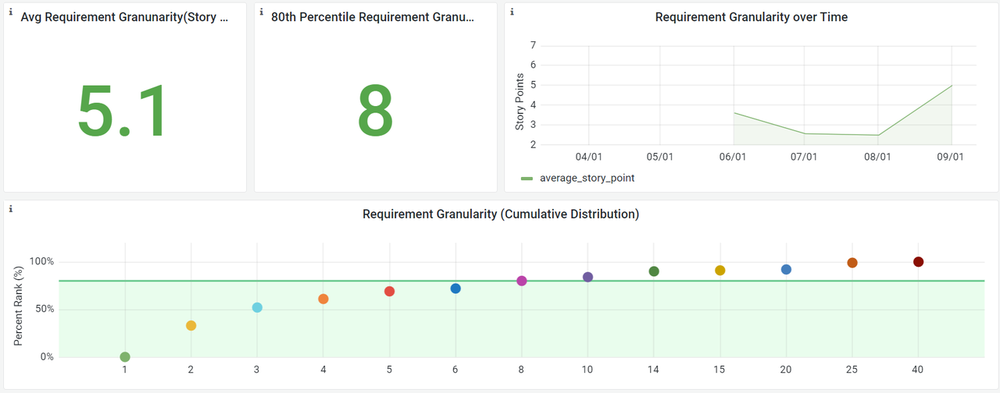
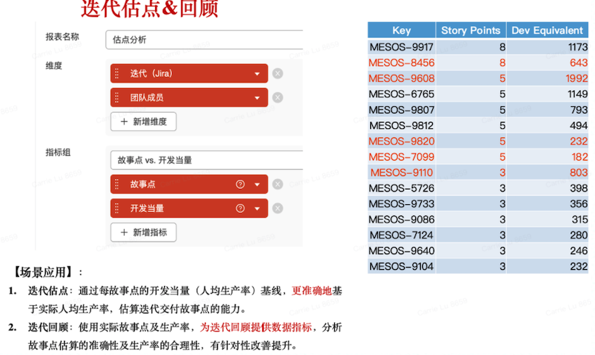

## 需求颗粒度

### 度量（Measure）

* 统计每个需求的故事点数（均值、中位数及80%分位）。

* 统计每个需求的交付时长（均值或中位数或80%分位），从研发到发布的时间（或者用户可配置）。
* 统计项目维度周期内的故事点数、代码行数或代码当量。计算平均每故事点的代码行数或[代码当量](https://www.openmari.dev/)。

* 统计每人每天的代码行数或代码当量。

### 分析（Analyze）

* 一个良好的需求的编写应该遵循INVEST原则，根据以下6点对需求进行分析。
  * Independent：独立性
  * Negotiable：可商讨
  * Valuable：有价值
  * Estimable：可评估
  * Small：短小
  * Testable：可测试
* 分析80%的需求的故事点数的分布区间，比如是否小于5个（建议结合团队实际情况，根据单迭代可交付需求的大小，设定阈值））
* 分析80%的需求的交付时长的分布区间，比如是否小于5天（建议结合团队实际情况，根据迭代时长，设定阈值）
* 对比每故事点的代码行数或[代码当量](https://www.openmari.dev/)
* 对比每人每天的代码行数或[代码当量](https://www.openmari.dev/)的大小

### 回顾（Review）

针对以上对需求的INVEST原则的分析，调研是否满足以下6个方面：

* 独立的：这个功能是否是独立实现的，低耦合；
* 可商讨：这个功能是否是有细节的，可以讨论更具体的内容；
* 有价值：这个功能是否可以交付使用或验证，不是幻想的功能；
* 可估计：每个需求是否可以估算工作量，是否估算了故事点；
* 合适的小：每个需求是否可以在一个迭代或一周内完成；每个故事点是否可以让一两个开发花费一两天可以做完，即每故事点的代码行数或代码当量是否接近每人每天的代码行数或代码当量。
* 可测试：这个功能是否可以测试，不依赖其他的功能。

### 改进（Improve）

基于回顾结果，聚焦关键根因，从规范、流程、工具、行为等方面给出针对性改进措施，明确提升目标、改进措施、验证周期及责任人。

以下为可参考的改进思路：

* 增加需求的独立性，降低耦合。
* 增加需求的细节。
* 合理拆分需求，分解出的需求尽量在一个迭代或一周内完成交付，如果无法完成就尝试继续分解。因为只有交付的需求才是有价值的，无法交付的需求对于当前迭代来说就是浪费。
* 为需求估算故事点。
* 尽量保证每故事点的代码行数或代码当量接近每人每天的代码行数或代码当量，让一两个开发花费一两天可以做完。
* 保证需求功能的独立和完成性，使其可测试。

改进成果也应当是可量化的，便于持续度量，追踪改进效果。

 
