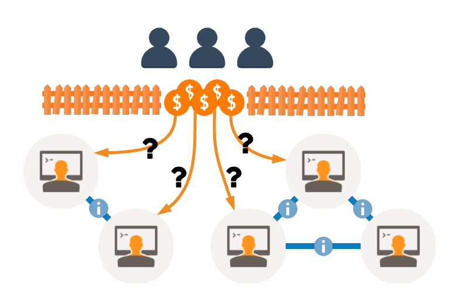

本文是我们7月16-17日在哈佛大学、麻省理工学院演讲的转述。
我们的演示文稿请见[这里](https://per.pub/4wZXMDwQ.pdf)。

<!--more-->

大约两年前，我面临一个事业上的两难选择，为商业公司打工还是投身开源软件开发？我喜欢开源世界的自由与开放，但现实中又放不下稳定的工资。毕竟，已是两个孩子的父亲。

为开源软件工作的自由，并不只是一件个人事务。影响巨大的[Heartbleed Bug](https://www.forbes.com/sites/josephsteinberg/2014/04/10/massive-internet-security-vulnerability-you-are-at-risk-what-you-need-to-do)漏洞很好地诠释了一个资助和维护都不足的开源项目如何“[make you bleed](http://blog.ssh.com/free-can-make-you-bleed)”。广为流行的科学计算引擎[Octave的作者](https://lists.gnu.org/archive/html/help-octave/2017-02/msg00062.html)，以及众多Linux桌面默认声音服务器[PulseAudio的主要维护者](https://lwn.net/Articles/711337/)，只是许许多多陷入财务困境的开源软件开发者中的两位代表。他们想方设法寻求收入来源，才能为自己倾注心血的项目继续做出贡献。

我们不禁要问，有没有办法将开源社区和商业公司的优势结合在一起？

### 商业公司和开源社区的分界

存在即合理。我们首先需要深入理解现实世界如何运转。有两个经济学概念能很好地解释为什么会有公司和开源两种不同的软件开发模式。

*信息不对称：* 软件用户很难了解程序员的开发工作，而每个程序员个体其实也缺乏全局信息以及对每个人贡献的了解。那么，谁又能来决定价值收益的分配呢？人们不得不采取如下两个办法中的一个：构建起公司的层级结构来进行价值分配，即便这个体系并不高效和公平；或者干脆放弃这些价值，免费开源，从而规避了分配问题。前者是商业公司的道路，后者是开源社区的道路。

*契约成本：* 为了促成交易，每个用户需要和每位贡献代码的程序员达成契约，订立合同；所有开发者之间也要为知识产权的共享和酬劳讨价还价，直至形成共识和契约。更糟糕的是，开发者可能随时退出当前项目，也会有新的程序员加入；用户们更是会来来去去。于是，人们想了两个办法来降低这些契约成本。一是设立一个法人的概念，作为软件用户和开发者的中间人；这样，每位用户或开发者都只需要和法人形成一个合同。二是将所有可能的契约简化并统一成一个简单的开源协议。这样的简化降低了契约成本，但通常只规定免费共享著作权，而舍弃了更加有利的合同关系。前者构成商业公司的基础，后者构成开源软件的基础。

> 总结起来，不论商业公司还是开源社区的开发模式，都是人们面对信息不对称和契约成本而做出的妥协。

尽管程序员们创造了宝贵的知识产权，他们得到的收益却难以和他们创造的价值相匹配。相当一部分价值要么被冗赘的公司组织内部消耗，要么在开源软件中放弃。通过正确的技术解决信息不对称和契约成本的问题，我们有可能做出更少的妥协，实现一个兼具公司和开源两者优势的解决方案。它将改变未来软件开发和创新的范式。

### 测量代码贡献的价值

为解决信息不对称，我们需要一个测量程序员代码贡献的工具。测量是人类文明的基石。物理学家花了90年，把时间测量的精度由[百万分之六秒](https://onlinelibrary.wiley.com/doi/abs/10.1002/j.1538-7305.1948.tb01343.x)提高到[10的18次方分之一秒](https://www.nature.com/articles/ncomms7896)。全体社会和自由市场持续地、动态地、综合地决定着物品的价格。时间是客观的而价格是[主观的](https://en.wikipedia.org/wiki/Subjective_theory_of_value)，Google搜索引擎则结合了两种方式来测量网页的相对重要性。距离Google两位创始人发表PageRank算法的论文，已经过去了20年。现在，我们是否该开始付出一些努力来测量代码贡献的价值了呢？

不久前，我们的短论文[《关于量化代码贡献的开发价值》](https://per.pub/A1Pd7xaM.pdf)在软件工程领域顶级国际学术会议[FSE 2018](https://2018.fseconference.org/)上发表。我们利用程序分析和机器学习技术，分析了代码的结构化价值和非结构化价值，代表了目前该领域的最新进展。

### 当股份制遇上开源项目

为了使测量结果具体化，我们为开源项目引入了一个*智力股权*（intellectual shareholding）的概念。程序员向一个项目贡献代码，得到相应的股权，其数量由我们的算法计算；而项目的收益，如捐赠或赞助等，会按照股份比例（即贡献）分配到开发者手中。

这种新的模型可以为开源开发者带来更加公平和长期的回报。传统上，一个项目只有少数核心开发成员可能通过[Patreon](https://www.patreon.com/)或者[Tidelift](https://tidelift.com/)获得定向资助。但开源软件凝聚了全社区的努力。主流前端框架vue.js的作者就曾在[一次采访](https://changelog.com/rfc/12)中描述了这个棘手的分配问题。而我们的项目股份制模型实现了更广泛、更公平的收入分配，惠及大多数贡献者。它可以增加对开发者的激励，促进社区的繁荣。

> Linus定律：有足够多双眼睛观察，所有程序问题终会显现。  
> 
> ——Eric S. Raymond，《[大教堂与集市](https://book.douban.com/subject/25881855/)》，2001年．

### 终极愿景

当前的股份制公司系统[起源于16世纪](https://en.wikipedia.org/wiki/Dutch_East_India_Company)
，使得资本可以合作、共享利润并进行长期投资，释放了巨大的生产力。过去三十年，Linux证明了一个遍布全球的松散的社区完全可以生产出统一的、复杂的软件系统。基于这些成功实践，我们希望构建一个新的面向智力和知识资产的股份制系统。它可以促使人才公开合作、共享收益并投入长期努力。

> Linux最重要的机能，其实不是关于技术的，而是关于社会的。  
> 
> ——Eric S. Raymond，《[大教堂与集市](https://book.douban.com/subject/25881855/)》，2001年．

我们正在与湾区的顶尖律师事务所[Orrick](https://www.orrick.com/)合作，构建一个法律框架（开源协议、用户协议、服务条款等）以实现灵活的合同语义和低廉的契约成本。一个项目的创始人只需要简单地设定若干参数，就可以在我们的平台生成所有项目需要的法律文本（以及[区块链智能合约](https://hbr.org/2017/01/the-truth-about-blockchain)），并为项目创建支付通道。本质上，一家公司就是一系列法律合同的集合。我们框架的目标就是为每个项目形成一个*虚拟公司*，而这个虚拟公司对全体开发者公开，并为该项目的贡献者们所有。

这样一家开放的虚拟公司，继承了智力股权的两个优势属性：按智力贡献进行价值分配，以及支持长期回报。在传统的公司组织中，你可能比同事更加努力但却拿着同样的工资，有时甚至会更少——因为你的同事长于宣传演示，而你的上司从来没有欣赏过你写的无比优美的代码。此外，你一旦离职，收入即会终止，尽管公司还在继续用你写的代码赚大钱。通过智力股份制，开发者可持续获得预期收入，即便他们选择退出一个项目或者这个项目只在一年后才产生利润。

通过结合我们构建的两个技术，开发者将避免传统公司低效的层级组织、死板的工资体系和严格的知识产权分隔。特别地，非代码贡献也同样可以融入我们的新模型。一个项目允许预留一定比例的股权或收益给非代码贡献者，例如外包的财务或市场团队。总之，一个开放的虚拟公司，既可以像传统商业公司一样获得利润，又可以保持开源项目一样的软件开发流程。程序员们将获得更多的自由选择他们真正喜爱和擅长的工作。

### 应用于实际项目

我们计划将代码贡献测量应用于实际开源项目，并观察社区对收入分配变化的反应：

* 与若干已经获得捐赠或资助的开源项目合作，采用新的收入分配方法，持续三个月以上。

* 向若干尚未获得捐赠的开源项目提供三个月资助，采用我们的方法进行分配。

**如果感兴趣将我们的收入分配方法应用于你的开源项目，请一定联系我们：hello@merico.dev！** 非常感谢你的支持！

